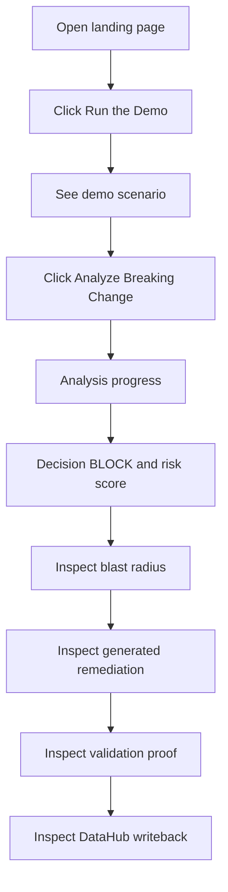
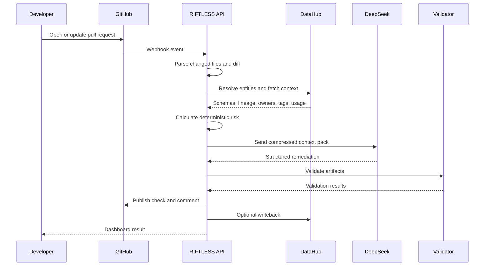
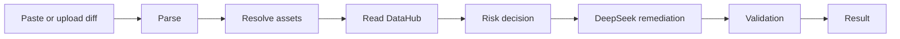
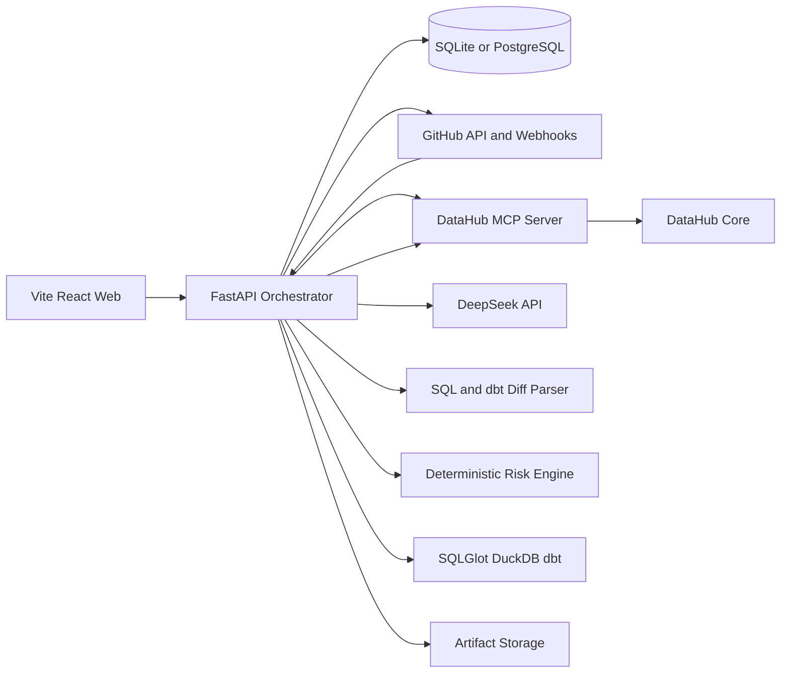
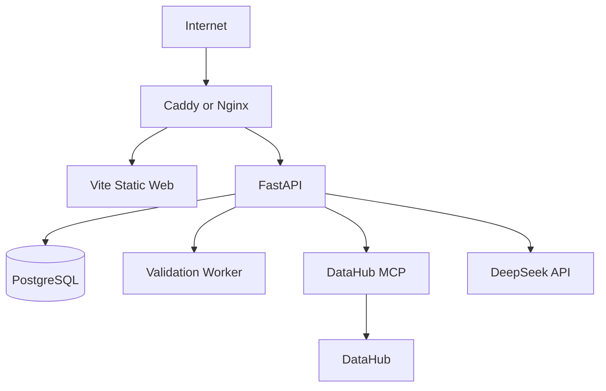

# PRD_RIFTLESS.md

> **RIFTLESS — Product Requirements Document**  
> **Tagline:** `Ship changes. Not fallout.`  
> **Document role:** Single Source of Truth / implementation bible  
> **Version:** 1.0.0  
> **Status:** Approved for phased implementation  
> **Primary language:** English for product UI and code; Indonesian for planning notes  
> **Frontend:** Vite + React + TypeScript  
> **Backend:** FastAPI + Python  
> **AI provider:** DeepSeek API  
> **Configured model ID:** `deepseek-v4-flash`  
> **Context platform:** DataHub Open Source + DataHub MCP Server  
> **Primary integration:** GitHub  
> **Validation stack:** SQLGlot + DuckDB + dbt Core  
> **Development strategy:** Local-first, VPS deployment later  
> **Repository license:** Apache License 2.0  
> **Smart contract:** Not used; explicitly out of scope

---

# 0. Document Authority

This file is the primary implementation contract for RIFTLESS.

Google AI Studio, Grok CLI, human contributors, and any other coding agent must treat this document as the default source of truth for:

- product scope,
- UX behavior,
- system architecture,
- data models,
- API contracts,
- AI behavior,
- security requirements,
- testing,
- deployment,
- phase boundaries,
- completion reports.

When implementation conflicts occur, use this order:

1. The newest explicit instruction from the product owner.
2. This PRD.
3. Approved API and database contracts already merged into the repository.
4. Approved frontend designs and brand assets.
5. Suggestions produced by coding tools.

Coding agents must not silently modify architecture, rename core entities, replace the stack, or add services not approved in this document.

---

# 1. Product Identity

## 1.1 Product name

**RIFTLESS**

## 1.2 Tagline

**Ship changes. Not fallout.**

## 1.3 One-line description

RIFTLESS is a context-aware autonomous data change guardian that detects the organizational blast radius of schema and pipeline changes, generates a safe remediation, validates it, and writes the decision back into DataHub.

## 1.4 Core brand concept

The RIFTLESS logo represents broken data lineage that is reconnected by an intelligent repair bridge.

Brand meaning:

- dark lineage branch: upstream context,
- gray lineage branch: downstream dependency,
- central gap: breaking data change,
- signal-lime connector: RIFTLESS remediation and validation,
- overall silhouette: abstract letter `R`.

## 1.5 Approved visual identity

The chosen logo reference is the connected-lineage symbol plus uppercase `RIFTLESS` wordmark.

Expected production assets:

```text
apps/web/src/assets/brand/
├── riftless-symbol-light.svg
├── riftless-symbol-dark.svg
├── riftless-wordmark-light.svg
├── riftless-wordmark-dark.svg
├── riftless-lockup-light.svg
├── riftless-lockup-dark.svg
├── favicon.svg
└── social-preview.png
```

Raster reference files must not become the only production logo source. A clean scalable SVG version must be created.

## 1.6 Brand colors

```css
:root {
  --riftless-ink: #11181B;
  --riftless-paper: #F7F4ED;
  --riftless-graph-gray: #68707C;
  --riftless-signal: #A8CD16;
  --riftless-critical: #FF5A4E;
  --riftless-warning: #F2A93B;
  --riftless-success: #69DB7C;
  --riftless-muted: #B8B8B0;
}
```

Rules:

- use signal lime sparingly,
- do not use gradients in core identity,
- do not add neon glow,
- do not replace the symbol with a shield, robot, database cylinder, or generic AI star,
- maintain clear spacing between symbol and wordmark.

---

# 2. Executive Summary

RIFTLESS prevents breaking data changes before they reach production.

When a developer opens a GitHub Pull Request that changes SQL, dbt models, schemas, or data pipeline configuration, RIFTLESS:

1. reads the proposed code change,
2. detects changed datasets and columns,
3. resolves those changes to DataHub entities,
4. retrieves real organizational context:
   - schema,
   - column lineage,
   - downstream lineage,
   - ownership,
   - tags,
   - glossary terms,
   - documentation,
   - query usage,
   - quality signals,
   - ML lineage,
5. calculates the blast radius,
6. applies deterministic policy rules,
7. produces a decision:
   - `ALLOW`,
   - `WARN`,
   - `BLOCK`,
8. sends a compressed context pack to DeepSeek,
9. receives structured remediation artifacts,
10. validates those artifacts using SQLGlot, DuckDB, and dbt,
11. publishes the result to:
    - the RIFTLESS website,
    - GitHub checks/comments,
    - downloadable generated artifacts,
12. writes the decision and knowledge back into DataHub.

RIFTLESS is not:

- a generic chatbot,
- a simple lineage viewer,
- a generic code generator,
- a text-to-SQL clone,
- a production migration executor.

Its unique value is the closed loop:

```text
CHANGE
  → CONTEXT
  → IMPACT
  → DECISION
  → REPAIR
  → VALIDATION
  → WRITEBACK
```

---

# 3. Product Vision

## 3.1 Vision statement

Make every important data change safe to ship because the full blast radius is known, remediation is generated, and compatibility is proven before merge.

## 3.2 Product promise

A developer should never discover the true impact of a schema change after production breaks.

## 3.3 Positioning

For data engineers, analytics engineers, ML engineers, and data platform teams, RIFTLESS is an autonomous change guardian that understands the full organizational data graph before reviewing or repairing code.

Unlike static linters or generic AI code reviewers, RIFTLESS reasons with real DataHub context and validates every generated change before it can be trusted.

## 3.4 Product principles

### Context before generation

DeepSeek must not generate remediation until relevant DataHub context has been retrieved and normalized.

### Deterministic before probabilistic

Risk scores and merge decisions are produced by a deterministic policy engine, not by an LLM opinion.

### Prove before trust

Generated SQL, dbt files, tests, and rollback scripts must be parsed and validated.

### Human control

RIFTLESS must not perform destructive production actions automatically.

### Explain with evidence

Every warning or block must cite concrete evidence.

### Graceful degradation

If DeepSeek fails, risk analysis must still work.

### Audit every side effect

Every GitHub and DataHub mutation must be recorded.

### Build one complete flow first

A reliable end-to-end demo is more important than broad but shallow integrations.

---

# 4. Problem Definition

## 4.1 Core problem

Repository-level code review cannot see the full organizational data ecosystem.

A developer may rename or remove a column without knowing that it is used by:

- downstream dbt models,
- executive dashboards,
- scheduled queries,
- ML features,
- production models,
- external teams,
- critical governance workflows.

Data catalogs expose this information, but a human still has to investigate the graph, understand the impact, contact owners, design a migration, create tests, and document the decision.

RIFTLESS automates that workflow while keeping the decision evidence-based and reviewable.

## 4.2 Common failure scenarios

- dropped column breaks a dashboard,
- type narrowing silently truncates values,
- renamed field breaks an ML feature,
- contract change invalidates external consumers,
- deprecated field is removed before the deadline,
- critical dataset changes without owner approval,
- generated SQL uses nonexistent columns,
- generic AI creates a migration that compiles but breaks compatibility.

## 4.3 Why DataHub is central

DataHub acts as the organizational context layer.

RIFTLESS must meaningfully use:

- dataset schemas,
- field metadata,
- column lineage,
- entity lineage,
- ownership,
- tags,
- glossary,
- domains,
- quality signals,
- incidents,
- ML entities where available,
- metadata writeback.

DataHub is not optional branding. It is the core context graph required for the product to work.

---

# 5. Goals and Non-Goals

## 5.1 MVP goals

### G-01 — Detect breaking data changes

MVP must detect:

- column addition,
- column drop,
- column rename,
- data type change,
- nullability change,
- table/model rename,
- table/model removal,
- dbt contract changes.

### G-02 — Resolve changes to DataHub

RIFTLESS must map changed SQL/dbt entities to DataHub dataset and field URNs.

### G-03 — Calculate blast radius

RIFTLESS must traverse downstream lineage and categorize affected assets.

### G-04 — Produce deterministic risk decisions

Every analysis must return:

- risk score `0–100`,
- decision,
- findings,
- evidence,
- required actions.

### G-05 — Generate remediation through DeepSeek

DeepSeek must produce structured candidate artifacts.

### G-06 — Validate generated artifacts

No artifact may receive `VALIDATED` status without executable checks.

### G-07 — Present results clearly

The website must make the result understandable in under 30 seconds.

### G-08 — Publish GitHub feedback

RIFTLESS must support GitHub check/comment output.

### G-09 — Write results back to DataHub

RIFTLESS must create or update useful metadata after analysis.

### G-10 — Provide judge-ready demo mode

A judge must be able to test the flow without private credentials.

## 5.2 Non-goals for MVP

The MVP will not:

- execute migrations in production,
- auto-merge pull requests,
- modify a production warehouse,
- become a full DataHub replacement,
- support every SQL dialect,
- support every Git provider,
- implement enterprise SSO,
- implement billing,
- implement full multi-tenancy,
- implement a real production ML retraining engine,
- use blockchain,
- use a smart contract,
- issue tokens,
- require a wallet,
- use Ollama,
- use a local LLM,
- use Next.js,
- use Supabase unless explicitly approved later.

---

# 6. Success Criteria

## 6.1 Hackathon success criteria

The submission is considered complete when:

1. a sample GitHub-style change is analyzed end-to-end,
2. DataHub context is read through the approved integration,
3. at least four downstream asset types are visible in the blast radius,
4. the decision is deterministic,
5. DeepSeek produces remediation artifacts,
6. generated SQL is validated,
7. dbt compile/test results are displayed,
8. DataHub writeback is demonstrated,
9. the project is available in a public repository,
10. Apache 2.0 license is present,
11. `examples/` contains sample inputs and outputs,
12. the demo video is under three minutes,
13. setup documentation is clear and reproducible.

## 6.2 Product quality metrics

- no invalid artifact marked as validated,
- every `BLOCK` contains at least one evidence object,
- every side effect has an audit log,
- no API key reaches the frontend,
- zero TypeScript errors in production build,
- zero Python test failures in the approved flow,
- no uncaught console errors,
- demo flow works at 1440, 1024, 768, 430, 390, and 360 px,
- accessible keyboard navigation,
- reduced-motion support,
- meaningful empty, loading, error, and retry states.

---

# 7. Personas

## 7.1 Analytics Engineer

Needs to safely rename columns and evolve dbt models.

Primary concerns:

- downstream models,
- dashboard breakage,
- schema contracts,
- migration compatibility.

## 7.2 Data Platform Engineer

Needs automated policy enforcement across repositories and teams.

Primary concerns:

- ownership,
- critical assets,
- lineage depth,
- reliability,
- auditability.

## 7.3 ML Engineer

Needs visibility into model and feature impact.

Primary concerns:

- feature schema drift,
- training-serving mismatch,
- model deployment risk,
- silent downstream failure.

## 7.4 Data Owner or Governance Lead

Needs approval and a durable decision record.

Primary concerns:

- policy compliance,
- owner notification,
- documentation,
- incident traceability.

## 7.5 Hackathon Judge

Needs a fast and clear experience.

Primary concerns:

- what the product does,
- why DataHub is necessary,
- whether the implementation is real,
- whether the generated output is useful.

---

# 8. Jobs To Be Done

1. When I change a schema, show every important downstream consumer.
2. When a change is dangerous, explain exactly why.
3. When a repair is possible, generate a patch I can review.
4. Before I trust the patch, prove it compiles and runs.
5. When a critical asset is involved, include owners and policy.
6. After a decision is made, save the knowledge in DataHub.
7. As a judge, let me experience the full value in a few clicks.

---

# 9. Primary Use Cases

## UC-01 — Rename a column

Input:

```sql
SELECT
  customer_id AS customer_key,
  order_amount
FROM raw.orders
```

Expected behavior:

- identify rename,
- resolve dataset and field,
- retrieve downstream context,
- calculate risk,
- generate compatibility alias,
- generate dbt tests,
- generate rollback,
- validate output,
- show result.

## UC-02 — Drop a critical column

Input removes `customer_id`.

DataHub context:

- tag `Critical`,
- executive dashboard,
- production ML feature,
- active query usage.

Expected decision: `BLOCK`.

## UC-03 — Add nullable column

Expected decision: usually `ALLOW`, unless policy states otherwise.

## UC-04 — Type widening

Example: `INTEGER → BIGINT`.

Expected decision: `ALLOW` or `WARN`, depending on consumers.

## UC-05 — Type narrowing

Example: `BIGINT → INTEGER`.

Expected decision: generally `BLOCK`.

## UC-06 — Analyze pasted diff

A user pastes a unified diff without GitHub installation.

## UC-07 — Re-run after remediation

The user applies a generated patch and reruns analysis.

## UC-08 — Write decision to DataHub

The user approves a writeback action.

---

# 10. Product Modes

## 10.1 Demo Snapshot Mode

Purpose:

- reliable judge experience,
- no private credentials,
- fast execution,
- honest representation.

Rules:

- display `DEMO SNAPSHOT` badge,
- use approved sample metadata,
- use pre-generated or cached DeepSeek output when required,
- do not claim a live DataHub request if none occurred,
- validation may still execute live in the backend.

## 10.2 Live Mode

Uses:

- live DataHub,
- DataHub MCP Server,
- DeepSeek API,
- GitHub integration,
- real validation.

## 10.3 Dry Run Mode

Reads and analyzes everything but does not write to GitHub or DataHub.

## 10.4 Offline Rule Mode

If DeepSeek is unavailable:

- run parsing,
- run DataHub context retrieval if available,
- calculate risk,
- return template-based summary,
- mark AI artifacts as unavailable,
- never fake a completed AI response.

---

# 11. Product Scope

## 11.1 MVP scope

- landing page,
- application dashboard,
- run history,
- run detail,
- blast radius visualization,
- remediation viewer,
- validation viewer,
- writeback viewer,
- demo trigger,
- pasted diff input,
- GitHub abstraction,
- DataHub integration,
- deterministic risk engine,
- DeepSeek API client,
- SQLGlot validation,
- DuckDB execution,
- dbt adapter,
- SQLite persistence,
- Docker Compose,
- audit log,
- sample repository,
- sample output artifacts.

## 11.2 Stretch goals

- real GitHub App installation,
- Slack alerts,
- DataHub incident resolution,
- policy editor,
- owner approvals,
- PostgreSQL,
- authentication,
- multi-repository support,
- GitLab support,
- advanced ML lineage policies.

---

# 12. Information Architecture

## 12.1 Public routes

```text
/
├── /demo
├── /architecture
├── /docs
├── /privacy
└── /license
```

## 12.2 Application routes

```text
/app
├── /app/overview
├── /app/analyze
├── /app/runs
├── /app/runs/:runId
│   ├── overview
│   ├── blast-radius
│   ├── remediation
│   ├── validation
│   ├── writeback
│   └── audit
├── /app/integrations
├── /app/policies
└── /app/settings
```

## 12.3 Navigation

Desktop:

- brand lockup,
- Overview,
- Runs,
- Analyze,
- Integrations,
- Try Demo,
- GitHub link.

Mobile:

- compact header,
- accessible menu,
- no hover-only actions.

---

# 13. Frontend Requirements

## 13.1 Frontend technology

Required:

- Vite,
- React,
- TypeScript,
- React Router,
- Tailwind CSS,
- TanStack Query,
- Zod,
- a lightweight state manager only if needed,
- a code editor or syntax highlighter,
- accessible graph visualization.

Do not use:

- Next.js,
- direct server secrets in frontend,
- untyped API payloads,
- hardcoded production data inside UI components.

## 13.2 Frontend architecture

```text
apps/web/
├── public/
├── src/
│   ├── app/
│   │   ├── router/
│   │   ├── providers/
│   │   └── layouts/
│   ├── assets/
│   │   └── brand/
│   ├── components/
│   │   ├── ui/
│   │   ├── brand/
│   │   ├── charts/
│   │   ├── graph/
│   │   └── code/
│   ├── features/
│   │   ├── demo/
│   │   ├── runs/
│   │   ├── analysis/
│   │   ├── remediation/
│   │   ├── validation/
│   │   ├── writeback/
│   │   └── integrations/
│   ├── lib/
│   │   ├── api/
│   │   ├── schemas/
│   │   ├── formatting/
│   │   └── constants/
│   ├── pages/
│   ├── styles/
│   ├── types/
│   └── main.tsx
├── index.html
├── vite.config.ts
└── package.json
```

## 13.3 Visual direction

The product must feel:

- precise,
- engineering-led,
- editorial,
- premium,
- dark and controlled,
- cinematic on the landing page,
- highly usable inside the application.

Avoid:

- template SaaS layouts,
- excessive rounded cards,
- pill buttons everywhere,
- fake terminal decoration,
- neon glow,
- gradients,
- glassmorphism,
- generic AI stars,
- constant fade-up animations.

## 13.4 Landing page

### Hero copy

```text
RIFTLESS

SHIP CHANGES.
NOT FALLOUT.

The context-aware agent that finds the blast radius,
repairs breaking data changes, and validates every fix.
```

Primary CTA:

```text
Run the Demo
```

Secondary CTA:

```text
View Source
```

Supporting statement:

```text
Powered by DataHub context.
Reasoned with DeepSeek.
Proven by executable validation.
```

### Narrative sequence

1. A small schema change appears.
2. The lineage graph fractures.
3. RIFTLESS traces downstream impact.
4. A decision appears.
5. A repair bridge reconnects the graph.
6. Validation proves the repair.
7. The decision is written back.

Landing page motion must enhance this story but static layout must remain strong without animation.

## 13.5 Overview dashboard

Display:

- total runs,
- blocked changes,
- remediated changes,
- protected assets,
- validation pass rate,
- risk distribution,
- recent runs.

## 13.6 Run list

Fields:

- run ID,
- repository,
- pull request or source,
- change summary,
- decision,
- risk score,
- status,
- mode,
- started time,
- duration.

Filters:

- decision,
- status,
- date,
- mode,
- repository,
- search.

## 13.7 Run detail

### Overview tab

Show:

- change summary,
- decision,
- risk score,
- current state,
- changed assets,
- key findings,
- affected owners,
- required actions,
- timeline.

### Blast Radius tab

Show:

- changed asset,
- downstream nodes,
- asset type,
- lineage depth,
- criticality,
- owners,
- evidence.

Graph must have an accessible list fallback.

### Remediation tab

Show generated files:

- compatibility SQL,
- dbt model patch,
- schema YAML,
- rollback SQL,
- deprecation markdown.

Features:

- syntax highlighting,
- diff mode,
- copy,
- download,
- checksum,
- validation status.

### Validation tab

Show:

- SQLGlot parse,
- DuckDB execution,
- dbt compile,
- dbt test,
- unresolved reference scan,
- policy re-evaluation.

### Writeback tab

Show:

- DataHub tag actions,
- structured properties,
- document creation,
- description updates,
- incident creation or resolution,
- GitHub check/comment.

### Audit tab

Show every important internal and external event.

## 13.8 Analyze page

Input options:

1. demo scenario,
2. paste unified diff,
3. upload `.diff` or `.patch`,
4. GitHub owner/repository/PR number.

Controls:

- demo/live/dry-run mode,
- lineage depth,
- enable AI remediation,
- enable GitHub writeback,
- enable DataHub writeback.

## 13.9 Frontend state requirements

Every asynchronous screen must support:

- idle,
- loading,
- partial progress,
- success,
- empty,
- recoverable error,
- fatal error,
- retry.

## 13.10 Responsive requirements

Must support:

- 1440,
- 1280,
- 1024,
- 768,
- 430,
- 390,
- 360 px.

## 13.11 Accessibility requirements

- semantic HTML,
- keyboard navigation,
- visible focus,
- adequate contrast,
- skip link,
- screen-reader labels,
- reduced-motion support,
- no color-only status communication,
- accessible graph fallback.

---

# 14. User Flows

## 14.1 Judge demo flow



Requirements:

- no login,
- no credential input,
- result in a few clicks,
- clear badge showing snapshot or live mode.

## 14.2 GitHub pull request flow



## 14.3 Manual diff flow



## 14.4 Re-analysis flow

1. user opens a blocked run,
2. user downloads or applies remediation,
3. user triggers re-analysis,
4. a new run is created,
5. the new run references the previous run,
6. the UI compares previous and current risk,
7. successful remediation may resolve a DataHub incident.

---

# 15. System Architecture

## 15.1 High-level architecture



## 15.2 Backend modules

```text
apps/api/
├── app/
│   ├── api/
│   │   ├── routes/
│   │   ├── dependencies/
│   │   └── middleware/
│   ├── core/
│   │   ├── config.py
│   │   ├── logging.py
│   │   ├── security.py
│   │   └── errors.py
│   ├── domain/
│   │   ├── runs/
│   │   ├── changes/
│   │   ├── risk/
│   │   ├── remediation/
│   │   ├── validation/
│   │   ├── writeback/
│   │   └── audit/
│   ├── integrations/
│   │   ├── datahub/
│   │   ├── deepseek/
│   │   ├── github/
│   │   ├── dbt/
│   │   └── duckdb/
│   ├── services/
│   ├── repositories/
│   ├── models/
│   ├── schemas/
│   ├── workers/
│   └── main.py
├── tests/
├── alembic/
├── pyproject.toml
└── Dockerfile
```

## 15.3 Architectural boundaries

The system must separate:

1. parsing,
2. context retrieval,
3. risk calculation,
4. AI generation,
5. validation,
6. external mutation,
7. presentation.

An LLM failure must not corrupt risk logic.

A writeback failure must not erase successful analysis.

---

# 16. Analysis Pipeline

## 16.1 Pipeline states

```text
QUEUED
→ INGESTING_CHANGE
→ PARSING_CHANGE
→ RESOLVING_ASSETS
→ FETCHING_CONTEXT
→ SCORING_RISK
→ GENERATING_REMEDIATION
→ VALIDATING
→ READY_FOR_WRITEBACK
→ WRITING_BACK
→ COMPLETED
```

Failure states:

```text
FAILED_INPUT
FAILED_PARSE
FAILED_CONTEXT
FAILED_AI
FAILED_VALIDATION
FAILED_WRITEBACK
CANCELLED
```

Partial completion is allowed.

Example:

- risk completed,
- AI failed,
- run status `FAILED_AI`,
- risk result remains visible.

## 16.2 Step A — Change ingestion

Sources:

- demo fixture,
- pasted unified diff,
- uploaded patch,
- GitHub pull request.

Normalize to:

```json
{
  "source_type": "github_pr",
  "repository": "riftless-demo/commerce-analytics",
  "base_ref": "main",
  "head_ref": "rename-customer-id",
  "files": [],
  "raw_diff": ""
}
```

## 16.3 Step B — Change parsing

Supported files:

- `.sql`,
- `.yml`,
- `.yaml`,
- dbt `schema.yml`,
- dbt model SQL,
- migration SQL.

Parser output:

```json
{
  "change_items": [
    {
      "change_type": "RENAME_COLUMN",
      "dataset_hint": "analytics.orders",
      "old_name": "customer_id",
      "new_name": "customer_key",
      "old_type": "VARCHAR",
      "new_type": "VARCHAR",
      "file_path": "models/orders.sql",
      "line_start": 4,
      "line_end": 4,
      "confidence": 0.96
    }
  ]
}
```

## 16.4 Step C — Asset resolution

Resolution signals:

- explicit table names,
- dbt manifest nodes,
- catalog/schema/table identifiers,
- file-to-model mapping,
- DataHub search,
- configured environment mapping.

Resolution result:

```json
{
  "dataset_urn": "urn:li:dataset:(urn:li:dataPlatform:dbt,analytics.orders,PROD)",
  "field_path": "customer_id",
  "confidence": 0.93,
  "resolution_method": "dbt_manifest_and_datahub_search"
}
```

Low-confidence mappings must be marked and cannot silently trigger destructive writeback.

## 16.5 Step D — Context retrieval

Retrieve only relevant context.

Required context types:

- schema,
- changed field,
- downstream lineage,
- column lineage,
- owners,
- tags,
- glossary terms,
- domain,
- descriptions,
- query usage if available,
- quality signals,
- incidents,
- ML lineage if available.

Context must be normalized into internal domain models instead of passing raw MCP responses across the whole application.

## 16.6 Step E — Risk scoring

The deterministic engine produces:

- findings,
- weighted score,
- decision,
- required actions.

## 16.7 Step F — DeepSeek generation

DeepSeek receives a minimized context pack.

## 16.8 Step G — Validation

Generated artifacts are parsed and executed.

## 16.9 Step H — Publication

Results are stored and displayed.

## 16.10 Step I — Writeback

Writeback only occurs when enabled and allowed.

---

# 17. Deterministic Risk Engine

## 17.1 Decisions

```text
ALLOW
WARN
BLOCK
```

## 17.2 Base score suggestions

| Change | Base score |
|---|---:|
| Add nullable column | 5 |
| Add required column | 30 |
| Rename column | 45 |
| Drop column | 70 |
| Type widening | 15 |
| Type narrowing | 55 |
| Nullability relaxed | 5 |
| Nullability tightened | 40 |
| Drop table/model | 85 |
| Rename table/model | 60 |

## 17.3 Context modifiers

| Evidence | Score modifier |
|---|---:|
| No downstream consumers | -15 |
| 1–3 downstream consumers | +10 |
| 4–10 downstream consumers | +20 |
| More than 10 consumers | +30 |
| Critical tag | +20 |
| PII tag | +10 |
| Executive dashboard downstream | +15 |
| Production ML deployment downstream | +25 |
| Active query usage | +10 |
| Existing unresolved incident | +10 |
| Approved deprecation window completed | -10 |
| Compatibility layer supplied | -25 |
| Owner approval present | -10 |
| Generated fix validated | -20 |
| Validation failed | +30 |

Final score is clamped to `0–100`.

## 17.4 Decision thresholds

```text
0–29   → ALLOW
30–69  → WARN
70–100 → BLOCK
```

Policy rules may force a decision regardless of score.

## 17.5 Hard-block rules

Examples:

```text
DROP_COLUMN
AND Critical tag
AND downstream consumer exists
→ BLOCK
```

```text
TYPE_NARROWING
AND production ML deployment downstream
→ BLOCK
```

```text
DROP_TABLE
AND owner approval missing
→ BLOCK
```

## 17.6 Risk finding schema

```json
{
  "code": "CRITICAL_DOWNSTREAM_DEPENDENCY",
  "severity": "CRITICAL",
  "title": "Production ML deployment depends on this field",
  "description": "The changed field is used by a feature connected to a production model deployment.",
  "score_delta": 25,
  "evidence_ids": ["ev_123", "ev_124"],
  "required_action": "Provide a backward-compatible migration and owner approval."
}
```

## 17.7 Risk engine requirements

- pure deterministic functions where possible,
- unit tests for all policy rules,
- policy version stored on every run,
- no DeepSeek call inside the risk engine,
- reproducible result for identical input.

---

# 18. DeepSeek Integration

## 18.1 Provider

DeepSeek API.

## 18.2 Model

User-selected configured model ID:

```text
deepseek-v4-flash
```

The implementation must treat the model name as configuration, not hardcoded business logic.

```env
DEEPSEEK_MODEL=deepseek-v4-flash
```

## 18.3 Security

The API key must exist only on the backend.

```env
DEEPSEEK_API_KEY=
DEEPSEEK_BASE_URL=
DEEPSEEK_MODEL=deepseek-v4-flash
```

Never:

- expose key through Vite environment variables,
- return key in API responses,
- log key,
- commit key,
- place key in frontend code,
- send full secrets in error traces.

## 18.4 DeepSeek responsibilities

DeepSeek may:

- explain blast radius,
- propose migration strategy,
- generate compatibility SQL,
- generate dbt model changes,
- generate dbt tests,
- generate rollback SQL,
- generate deprecation documentation,
- summarize owner actions.

DeepSeek may not:

- set the final risk decision,
- write directly to DataHub,
- write directly to GitHub,
- mark its own output validated,
- execute production SQL,
- receive unrelated secrets.

## 18.5 Context pack

Only send the minimum useful context.

```json
{
  "change": {},
  "resolved_assets": [],
  "affected_assets": [],
  "owners": [],
  "policies": [],
  "risk_findings": [],
  "schema": {},
  "required_artifacts": [],
  "output_contract_version": "1.0"
}
```

## 18.6 Structured output contract

DeepSeek must return JSON matching a backend schema.

```json
{
  "summary": "string",
  "strategy": "BACKWARD_COMPATIBLE_ALIAS",
  "assumptions": ["string"],
  "artifacts": [
    {
      "artifact_type": "COMPATIBILITY_SQL",
      "path": "generated/compatibility.sql",
      "language": "sql",
      "content": "string",
      "purpose": "string"
    }
  ],
  "owner_actions": ["string"],
  "limitations": ["string"]
}
```

## 18.7 Prompting rules

System prompt must instruct the model:

- use only supplied schema,
- do not invent columns,
- prefer backward-compatible changes,
- generate idempotent SQL where possible,
- include rollback,
- return JSON only,
- list assumptions,
- never claim validation success,
- avoid destructive production execution.

## 18.8 Retry policy

Suggested:

- maximum two retries,
- retry only on:
  - timeout,
  - rate limit,
  - invalid JSON,
  - transient server error,
- second retry receives validation/parser feedback,
- no infinite agent loop.

## 18.9 Token and cost control

- compress lineage context,
- cap downstream assets,
- summarize repeated metadata,
- cache by deterministic input hash,
- store model usage metadata,
- do not repeatedly regenerate identical artifacts.

Suggested cache key:

```text
SHA256(
  normalized_change
  + normalized_context
  + policy_version
  + prompt_version
  + model_name
)
```

## 18.10 AI audit metadata

Store:

- provider,
- model,
- prompt version,
- request ID,
- input token count if available,
- output token count if available,
- latency,
- retry count,
- cache hit,
- response checksum,
- status.

Do not store raw secrets.

---

# 19. Remediation Artifacts

## 19.1 Supported artifact types

```text
COMPATIBILITY_SQL
DBT_MODEL_PATCH
DBT_SCHEMA_YAML
DBT_TEST
ROLLBACK_SQL
DEPRECATION_DOCUMENT
OWNER_NOTIFICATION
GITHUB_COMMENT
DATAHUB_DECISION_DOCUMENT
```

## 19.2 Artifact status

```text
GENERATED
PARSING
INVALID
VALIDATING
VALIDATED
VALIDATION_FAILED
SUPERSEDED
```

## 19.3 Required artifacts by change

### Rename column

- compatibility SQL,
- dbt patch,
- tests,
- rollback,
- deprecation document.

### Drop column

- migration plan,
- compatibility or staged removal plan,
- tests,
- rollback,
- owner actions.

### Type change

- safe cast or migration,
- tests,
- rollback,
- assumptions.

## 19.4 Artifact storage

Development:

```text
var/artifacts/{run_id}/
```

Database stores metadata and relative path.

Do not store huge file contents redundantly if file storage is used, but MVP may store small contents in SQLite for simplicity.

---

# 20. Validation Engine

## 20.1 Validation layers

### Layer 1 — Structural JSON validation

Validate DeepSeek output with Pydantic.

### Layer 2 — SQL parsing

Use SQLGlot.

Checks:

- valid SQL,
- supported dialect,
- referenced fields,
- destructive statements,
- multiple statements.

### Layer 3 — DuckDB execution

Run generated migration against a disposable database fixture.

Checks:

- execution succeeds,
- expected columns exist,
- compatibility alias returns expected values,
- rollback executes when supported.

### Layer 4 — dbt compile

Run `dbt compile`.

### Layer 5 — dbt test

Run `dbt test`.

### Layer 6 — reference scan

Search for unresolved references to renamed or removed fields.

### Layer 7 — policy re-evaluation

Recalculate risk after applying the proposed compatibility plan.

## 20.2 Validation result schema

```json
{
  "validator": "duckdb_execution",
  "status": "PASSED",
  "started_at": "ISO-8601",
  "completed_at": "ISO-8601",
  "duration_ms": 812,
  "summary": "Compatibility view executed successfully.",
  "command": "sanitized command",
  "log_excerpt": "sanitized output",
  "details": {}
}
```

## 20.3 Validation rules

- validation runs in an isolated workspace,
- commands have timeouts,
- logs are sanitized,
- environment secrets are excluded,
- a failed required validator means artifact is not validated,
- the UI must distinguish `generated` from `validated`.

---

# 21. DataHub Integration

## 21.1 Role of DataHub

DataHub is the context graph and durable knowledge layer.

## 21.2 Read operations

RIFTLESS should retrieve:

- entity search results,
- dataset schema,
- field metadata,
- lineage,
- column lineage,
- ownership,
- tags,
- terms,
- domains,
- descriptions,
- incidents,
- query usage,
- quality metadata,
- ML entities.

## 21.3 Writeback operations

Depending on available MCP/API capabilities:

- add risk tag,
- set structured properties,
- append deprecation note,
- create decision document,
- create incident,
- resolve incident,
- add ownership or review reference only when explicitly approved.

## 21.4 Proposed writeback model

### Tags

```text
RIFTLESS_REVIEWED
RIFTLESS_BLOCKED
RIFTLESS_REMEDIATED
PENDING_BREAKING_CHANGE
```

### Structured properties

```text
riftless.last_run_id
riftless.last_risk_score
riftless.last_decision
riftless.last_reviewed_at
riftless.policy_version
riftless.remediation_status
```

### Decision document

Title:

```text
RIFTLESS Change Decision — {dataset} — {date}
```

Contents:

- proposed change,
- blast radius,
- risk findings,
- decision,
- generated remediation,
- validation summary,
- owners,
- GitHub link,
- run ID.

## 21.5 Writeback safety

- default to dry-run during development,
- preview actions before execution,
- require explicit configuration,
- use idempotency keys,
- store request and result,
- retry transient failures,
- never delete metadata in MVP.

---

# 22. GitHub Integration

## 22.1 MVP integration options

Priority order:

1. manual GitHub repository/PR input,
2. GitHub personal token for development,
3. webhook endpoint,
4. GitHub App as stretch goal.

## 22.2 Events

Supported:

- pull request opened,
- pull request synchronized,
- pull request reopened,
- manual rerun.

## 22.3 Output

### GitHub check

```text
RIFTLESS / Data Change Safety
```

Conclusion mapping:

- `ALLOW` → success,
- `WARN` → neutral,
- `BLOCK` → failure.

### Pull request comment

Must include:

- decision,
- risk score,
- affected asset counts,
- top findings,
- generated artifact summary,
- validation result,
- dashboard link.

## 22.4 GitHub security

- validate webhook signature,
- minimum token permissions,
- do not store repository secrets,
- sanitize logs,
- idempotent event processing,
- store delivery ID.

---

# 23. Database Design

## 23.1 Database strategy

Development and demo:

```text
SQLite
```

VPS production target:

```text
PostgreSQL
```

Use SQLAlchemy and Alembic so migration is possible.

## 23.2 Core tables

### `analysis_runs`

```sql
CREATE TABLE analysis_runs (
    id TEXT PRIMARY KEY,
    parent_run_id TEXT NULL,
    source_type TEXT NOT NULL,
    mode TEXT NOT NULL,
    repository_owner TEXT NULL,
    repository_name TEXT NULL,
    pull_request_number INTEGER NULL,
    base_ref TEXT NULL,
    head_ref TEXT NULL,
    input_hash TEXT NOT NULL,
    status TEXT NOT NULL,
    decision TEXT NULL,
    risk_score INTEGER NULL,
    policy_version TEXT NOT NULL,
    prompt_version TEXT NULL,
    started_at TEXT NOT NULL,
    completed_at TEXT NULL,
    duration_ms INTEGER NULL,
    error_code TEXT NULL,
    error_message TEXT NULL,
    created_at TEXT NOT NULL,
    updated_at TEXT NOT NULL,
    FOREIGN KEY(parent_run_id) REFERENCES analysis_runs(id)
);
```

### `source_files`

```sql
CREATE TABLE source_files (
    id TEXT PRIMARY KEY,
    run_id TEXT NOT NULL,
    file_path TEXT NOT NULL,
    change_status TEXT NOT NULL,
    old_content_hash TEXT NULL,
    new_content_hash TEXT NULL,
    additions INTEGER NOT NULL DEFAULT 0,
    deletions INTEGER NOT NULL DEFAULT 0,
    diff_text TEXT NULL,
    created_at TEXT NOT NULL,
    FOREIGN KEY(run_id) REFERENCES analysis_runs(id)
);
```

### `change_items`

```sql
CREATE TABLE change_items (
    id TEXT PRIMARY KEY,
    run_id TEXT NOT NULL,
    source_file_id TEXT NULL,
    change_type TEXT NOT NULL,
    dataset_hint TEXT NULL,
    resolved_dataset_urn TEXT NULL,
    field_path TEXT NULL,
    old_name TEXT NULL,
    new_name TEXT NULL,
    old_type TEXT NULL,
    new_type TEXT NULL,
    old_nullable INTEGER NULL,
    new_nullable INTEGER NULL,
    line_start INTEGER NULL,
    line_end INTEGER NULL,
    confidence REAL NOT NULL,
    resolution_status TEXT NOT NULL,
    metadata_json TEXT NULL,
    created_at TEXT NOT NULL,
    FOREIGN KEY(run_id) REFERENCES analysis_runs(id),
    FOREIGN KEY(source_file_id) REFERENCES source_files(id)
);
```

### `affected_assets`

```sql
CREATE TABLE affected_assets (
    id TEXT PRIMARY KEY,
    run_id TEXT NOT NULL,
    change_item_id TEXT NULL,
    urn TEXT NOT NULL,
    asset_type TEXT NOT NULL,
    name TEXT NOT NULL,
    platform TEXT NULL,
    field_path TEXT NULL,
    lineage_direction TEXT NOT NULL,
    lineage_depth INTEGER NOT NULL,
    criticality TEXT NULL,
    owners_json TEXT NULL,
    tags_json TEXT NULL,
    metadata_json TEXT NULL,
    created_at TEXT NOT NULL,
    FOREIGN KEY(run_id) REFERENCES analysis_runs(id),
    FOREIGN KEY(change_item_id) REFERENCES change_items(id)
);
```

### `evidence`

```sql
CREATE TABLE evidence (
    id TEXT PRIMARY KEY,
    run_id TEXT NOT NULL,
    evidence_type TEXT NOT NULL,
    source TEXT NOT NULL,
    source_reference TEXT NULL,
    title TEXT NOT NULL,
    description TEXT NOT NULL,
    payload_json TEXT NULL,
    created_at TEXT NOT NULL,
    FOREIGN KEY(run_id) REFERENCES analysis_runs(id)
);
```

### `risk_findings`

```sql
CREATE TABLE risk_findings (
    id TEXT PRIMARY KEY,
    run_id TEXT NOT NULL,
    code TEXT NOT NULL,
    severity TEXT NOT NULL,
    title TEXT NOT NULL,
    description TEXT NOT NULL,
    score_delta INTEGER NOT NULL,
    required_action TEXT NULL,
    evidence_ids_json TEXT NOT NULL,
    created_at TEXT NOT NULL,
    FOREIGN KEY(run_id) REFERENCES analysis_runs(id)
);
```

### `ai_generations`

```sql
CREATE TABLE ai_generations (
    id TEXT PRIMARY KEY,
    run_id TEXT NOT NULL,
    provider TEXT NOT NULL,
    model TEXT NOT NULL,
    prompt_version TEXT NOT NULL,
    request_id TEXT NULL,
    status TEXT NOT NULL,
    retry_count INTEGER NOT NULL DEFAULT 0,
    cache_hit INTEGER NOT NULL DEFAULT 0,
    input_tokens INTEGER NULL,
    output_tokens INTEGER NULL,
    latency_ms INTEGER NULL,
    response_checksum TEXT NULL,
    error_code TEXT NULL,
    error_message TEXT NULL,
    created_at TEXT NOT NULL,
    completed_at TEXT NULL,
    FOREIGN KEY(run_id) REFERENCES analysis_runs(id)
);
```

### `artifacts`

```sql
CREATE TABLE artifacts (
    id TEXT PRIMARY KEY,
    run_id TEXT NOT NULL,
    ai_generation_id TEXT NULL,
    artifact_type TEXT NOT NULL,
    path TEXT NOT NULL,
    language TEXT NULL,
    purpose TEXT NULL,
    content TEXT NULL,
    checksum TEXT NOT NULL,
    status TEXT NOT NULL,
    created_at TEXT NOT NULL,
    updated_at TEXT NOT NULL,
    FOREIGN KEY(run_id) REFERENCES analysis_runs(id),
    FOREIGN KEY(ai_generation_id) REFERENCES ai_generations(id)
);
```

### `validation_results`

```sql
CREATE TABLE validation_results (
    id TEXT PRIMARY KEY,
    run_id TEXT NOT NULL,
    artifact_id TEXT NULL,
    validator TEXT NOT NULL,
    status TEXT NOT NULL,
    required INTEGER NOT NULL DEFAULT 1,
    command_text TEXT NULL,
    summary TEXT NOT NULL,
    log_excerpt TEXT NULL,
    details_json TEXT NULL,
    started_at TEXT NOT NULL,
    completed_at TEXT NULL,
    duration_ms INTEGER NULL,
    FOREIGN KEY(run_id) REFERENCES analysis_runs(id),
    FOREIGN KEY(artifact_id) REFERENCES artifacts(id)
);
```

### `writeback_actions`

```sql
CREATE TABLE writeback_actions (
    id TEXT PRIMARY KEY,
    run_id TEXT NOT NULL,
    target_system TEXT NOT NULL,
    action_type TEXT NOT NULL,
    target_reference TEXT NOT NULL,
    idempotency_key TEXT NOT NULL,
    status TEXT NOT NULL,
    request_json TEXT NULL,
    response_json TEXT NULL,
    external_url TEXT NULL,
    retry_count INTEGER NOT NULL DEFAULT 0,
    created_at TEXT NOT NULL,
    completed_at TEXT NULL,
    error_message TEXT NULL,
    FOREIGN KEY(run_id) REFERENCES analysis_runs(id),
    UNIQUE(idempotency_key)
);
```

### `audit_events`

```sql
CREATE TABLE audit_events (
    id TEXT PRIMARY KEY,
    run_id TEXT NULL,
    actor_type TEXT NOT NULL,
    actor_id TEXT NULL,
    event_type TEXT NOT NULL,
    event_name TEXT NOT NULL,
    payload_json TEXT NULL,
    created_at TEXT NOT NULL,
    FOREIGN KEY(run_id) REFERENCES analysis_runs(id)
);
```

### `integration_status`

```sql
CREATE TABLE integration_status (
    id TEXT PRIMARY KEY,
    integration_type TEXT NOT NULL UNIQUE,
    status TEXT NOT NULL,
    last_checked_at TEXT NULL,
    metadata_json TEXT NULL,
    error_message TEXT NULL,
    updated_at TEXT NOT NULL
);
```

### `policy_versions`

```sql
CREATE TABLE policy_versions (
    id TEXT PRIMARY KEY,
    version TEXT NOT NULL UNIQUE,
    name TEXT NOT NULL,
    policy_json TEXT NOT NULL,
    is_active INTEGER NOT NULL DEFAULT 0,
    created_at TEXT NOT NULL
);
```

## 23.3 Suggested indexes

```sql
CREATE INDEX idx_runs_status ON analysis_runs(status);
CREATE INDEX idx_runs_created_at ON analysis_runs(created_at);
CREATE INDEX idx_runs_input_hash ON analysis_runs(input_hash);
CREATE INDEX idx_changes_run_id ON change_items(run_id);
CREATE INDEX idx_assets_run_id ON affected_assets(run_id);
CREATE INDEX idx_artifacts_run_id ON artifacts(run_id);
CREATE INDEX idx_validation_run_id ON validation_results(run_id);
CREATE INDEX idx_audit_run_id ON audit_events(run_id);
```

## 23.4 Identifier strategy

Use UUIDv7 or ULID for sortable unique IDs.

## 23.5 JSON fields

SQLite stores JSON as text. Application code must validate using Pydantic.

PostgreSQL migration may use JSONB later.

---

# 24. API Contract

Base path:

```text
/api/v1
```

## 24.1 Health

### `GET /health`

Response:

```json
{
  "status": "ok",
  "version": "1.0.0"
}
```

### `GET /health/dependencies`

Response must report safe status only.

## 24.2 Runs

### `GET /runs`

Query:

- `page`,
- `page_size`,
- `status`,
- `decision`,
- `mode`,
- `repository`,
- `search`.

### `GET /runs/{run_id}`

Returns run summary.

### `POST /runs/demo`

Creates a demo run.

Request:

```json
{
  "scenario": "rename_customer_id",
  "enable_ai": true,
  "enable_validation": true,
  "enable_writeback": false
}
```

### `POST /runs/analyze-diff`

Request:

```json
{
  "diff": "string",
  "repository": "optional string",
  "mode": "dry_run",
  "lineage_depth": 3,
  "enable_ai": true,
  "enable_datahub_writeback": false,
  "enable_github_writeback": false
}
```

### `POST /runs/github-pr`

Request:

```json
{
  "owner": "string",
  "repository": "string",
  "pull_request_number": 17,
  "mode": "live"
}
```

### `POST /runs/{run_id}/rerun`

Creates a child run.

### `POST /runs/{run_id}/cancel`

Cancels a cancellable run.

## 24.3 Run detail

### `GET /runs/{run_id}/changes`

### `GET /runs/{run_id}/blast-radius`

### `GET /runs/{run_id}/findings`

### `GET /runs/{run_id}/artifacts`

### `GET /runs/{run_id}/validations`

### `GET /runs/{run_id}/writebacks`

### `GET /runs/{run_id}/audit`

## 24.4 Artifacts

### `GET /artifacts/{artifact_id}`

### `GET /artifacts/{artifact_id}/download`

## 24.5 Writeback

### `POST /runs/{run_id}/writeback/preview`

### `POST /runs/{run_id}/writeback/execute`

Request:

```json
{
  "actions": [
    "DATAHUB_DECISION_DOCUMENT",
    "DATAHUB_RISK_PROPERTIES",
    "GITHUB_CHECK"
  ]
}
```

## 24.6 Integrations

### `GET /integrations`

### `POST /integrations/test/{integration_type}`

Do not return secrets.

## 24.7 Event streaming

Preferred MVP:

```text
Server-Sent Events
```

Endpoint:

```text
GET /runs/{run_id}/events
```

Example event:

```json
{
  "sequence": 7,
  "type": "RUN_STAGE_CHANGED",
  "stage": "FETCHING_CONTEXT",
  "message": "Tracing downstream lineage in DataHub.",
  "timestamp": "ISO-8601"
}
```

---

# 25. Error Model

All API errors must use a common shape.

```json
{
  "error": {
    "code": "DATAHUB_UNAVAILABLE",
    "message": "DataHub could not be reached.",
    "retryable": true,
    "details": {},
    "request_id": "req_123"
  }
}
```

Required categories:

- validation error,
- authentication error,
- authorization error,
- rate limit,
- DataHub error,
- DeepSeek error,
- GitHub error,
- parser error,
- validator error,
- internal error.

Do not leak stack traces to the frontend.

---

# 26. Security Requirements

## 26.1 Secret management

Secrets:

- DeepSeek API key,
- GitHub token or app secret,
- DataHub credentials,
- database URL,
- webhook secret.

Rules:

- `.env` is ignored,
- `.env.example` contains placeholders only,
- secrets loaded backend-side,
- secrets never serialized,
- logs sanitized.

## 26.2 Input security

- maximum upload size,
- allowlist file extensions,
- reject binary files,
- sanitize file paths,
- prevent path traversal,
- limit diff size,
- validate URLs,
- rate-limit public endpoints.

## 26.3 Command execution security

Validation runs shell commands.

Requirements:

- command allowlist,
- isolated working directory,
- timeout,
- no shell interpolation from raw user input,
- resource limits where possible,
- cleanup after completion,
- no host filesystem access beyond workspace.

## 26.4 GitHub webhook security

Validate signature and delivery ID.

## 26.5 DataHub writeback security

- dry-run default,
- explicit configuration,
- idempotency,
- no destructive delete,
- least-privilege credentials.

---

# 27. Smart Contract Logic

## 27.1 Decision

**RIFTLESS does not require or use a smart contract.**

## 27.2 Reason

The product’s trust model is based on:

- DataHub metadata,
- GitHub audit history,
- application audit events,
- deterministic policy versions,
- artifact checksums,
- validation results.

No blockchain is required to solve the core user problem.

## 27.3 Explicit exclusions

Do not add:

- Solidity,
- EVM,
- wallet connection,
- token,
- NFT,
- on-chain storage,
- blockchain audit log,
- crypto payment,
- Web3 authentication.

## 27.4 Future reconsideration rule

A smart contract may only be reconsidered if a future written requirement introduces a real cross-organization trust problem that cannot be reasonably solved with signed audit logs and conventional infrastructure.

Until then, smart contract logic is:

```text
NOT APPLICABLE
```

---

# 28. Repository Structure

Recommended monorepo:

```text
riftless/
├── apps/
│   ├── web/
│   └── api/
├── packages/
│   ├── contracts/
│   ├── policy/
│   └── fixtures/
├── examples/
│   ├── demo-dbt-project/
│   ├── diffs/
│   ├── generated/
│   ├── snapshots/
│   └── screenshots/
├── docs/
│   ├── architecture/
│   ├── brand/
│   ├── setup/
│   └── demo/
├── scripts/
├── infra/
│   ├── docker/
│   └── caddy/
├── var/
│   └── .gitkeep
├── .github/
│   ├── workflows/
│   └── ISSUE_TEMPLATE/
├── PRD_RIFTLESS.md
├── README.md
├── LICENSE
├── CONTRIBUTING.md
├── SECURITY.md
├── docker-compose.yml
├── Makefile
└── .env.example
```

---

# 29. Local Development

## 29.1 Required tools

- Git,
- Node.js LTS,
- pnpm,
- Python 3.12,
- uv or approved Python package manager,
- Docker,
- Docker Compose,
- dbt Core,
- DataHub quickstart dependencies.

## 29.2 Suggested commands

```bash
make setup
make dev
make test
make lint
make demo
```

## 29.3 Development services

```text
web
api
sqlite
datahub
datahub-mcp
duckdb-validator
```

DeepSeek remains external API.

---

# 30. VPS Deployment

## 30.1 Deployment goal

The VPS hosts:

- Vite static build,
- FastAPI,
- database,
- DataHub,
- DataHub MCP Server,
- validation worker,
- reverse proxy.

DeepSeek remains external.

## 30.2 Suggested services

```text
Caddy or Nginx
RIFTLESS Web
RIFTLESS API
Worker
PostgreSQL
DataHub services
DataHub MCP
Persistent artifact volume
```

## 30.3 Deployment topology



## 30.4 VPS requirements

The final VPS specification must consider DataHub, not only RIFTLESS API.

Minimum and recommended hardware must be tested before purchase.

## 30.5 Deployment safety

- TLS,
- firewall,
- database backups,
- persistent volumes,
- health checks,
- restart policy,
- log rotation,
- environment secrets outside repository.

---

# 31. Observability

## 31.1 Structured logging

Every log should include:

- timestamp,
- level,
- request ID,
- run ID when available,
- module,
- event name,
- safe metadata.

## 31.2 Metrics

Track:

- runs started,
- runs completed,
- stage duration,
- DeepSeek latency,
- DeepSeek failures,
- cache hit rate,
- validation pass rate,
- writeback failures,
- DataHub latency.

## 31.3 Audit trail

Audit important events:

- run created,
- source ingested,
- risk decision calculated,
- AI request made,
- artifact generated,
- validation executed,
- writeback previewed,
- writeback executed,
- retry,
- cancellation.

---

# 32. Testing Strategy

## 32.1 Frontend tests

- component tests,
- route tests,
- API state tests,
- accessibility tests,
- responsive checks,
- end-to-end demo flow.

## 32.2 Backend tests

- parser unit tests,
- asset resolution tests,
- risk engine unit tests,
- DeepSeek response parsing tests,
- DataHub adapter tests,
- validation tests,
- API integration tests,
- writeback idempotency tests.

## 32.3 Contract tests

Frontend and backend must share versioned schemas.

## 32.4 Golden fixtures

Store approved fixtures:

```text
examples/
├── diffs/rename_customer_id.diff
├── snapshots/datahub_context.json
├── generated/approved_deepseek_output.json
└── expected/run_result.json
```

## 32.5 Mandatory test scenarios

1. safe additive change,
2. rename with downstream dependencies,
3. drop critical field,
4. DataHub unavailable,
5. DeepSeek timeout,
6. invalid DeepSeek JSON,
7. validation failure,
8. writeback failure,
9. duplicate webhook,
10. rerun after remediation.

---

# 33. Performance Requirements

- landing page initial load target under 2.5 seconds,
- demo snapshot result target under 10 seconds,
- live sample target under 90 seconds,
- API list endpoint paginated,
- lineage retrieval bounded by depth and node count,
- no unbounded LLM context,
- no infinite retry loop,
- validation commands have timeouts.

---

# 34. Privacy and Data Handling

MVP should avoid storing:

- raw production data,
- database passwords,
- unrestricted query results,
- secrets,
- full sensitive records.

Store metadata and sample fixtures only.

If query text is stored, sanitize sensitive literals where practical.

---

# 35. Product Copy Guidelines

Tone:

- clear,
- technical,
- confident,
- evidence-based,
- no exaggerated claims.

Preferred:

```text
Blocked because 7 downstream assets depend on this field.
```

Avoid:

```text
Our revolutionary AI guarantees zero failures.
```

Decision labels:

```text
ALLOW
WARN
BLOCK
```

Validation labels:

```text
NOT RUN
RUNNING
PASSED
FAILED
```

---

# 36. Demo Scenario

## 36.1 Scenario name

```text
Rename customer_id to customer_key
```

## 36.2 Demo graph

```text
raw.orders.customer_id
  ↓
stg_orders.customer_id
  ↓
fct_customer_revenue.customer_id
  ├── Executive Revenue Dashboard
  └── customer_ltv_feature
        ↓
      churn_prediction_model
        ↓
      production_deployment
```

## 36.3 Expected risk

```text
Risk score: 94
Decision: BLOCK
```

## 36.4 Expected generated files

```text
generated/
├── compatibility.sql
├── models/orders.sql
├── models/schema.yml
├── rollback.sql
└── deprecation.md
```

## 36.5 Expected validators

```text
SQLGlot parse             PASSED
DuckDB migration          PASSED
dbt compile               PASSED
dbt test                  PASSED
Reference scan            PASSED
Policy re-evaluation      PASSED
```

## 36.6 Expected writeback

- tag `RIFTLESS_REMEDIATED`,
- risk score property,
- decision document,
- optional incident,
- GitHub check.

---

# 37. Three-Minute Demo Storyboard

## 0:00–0:20

Show the PR rename.

## 0:20–0:45

RIFTLESS reads DataHub and reveals the blast radius.

## 0:45–1:05

Display `BLOCK`, risk 94, and evidence.

## 1:05–1:40

Show generated compatibility patch, tests, rollback, and documentation.

## 1:40–2:10

Show validation passing.

## 2:10–2:35

Show GitHub check and DataHub writeback.

## 2:35–3:00

Close:

```text
Ship changes. Not fallout.
```

---

# 38. Phased Implementation Plan

The project must be implemented one phase at a time.

No next phase starts before the current phase is accepted.

## Phase F0 — Frontend foundation

Scope:

- Vite React TypeScript project,
- routing,
- design tokens,
- typography,
- approved logo integration,
- responsive shell,
- shared UI primitives,
- error boundary,
- reduced-motion foundation.

Acceptance:

- build passes,
- no console errors,
- responsive shell works,
- brand system is consistent,
- no backend dependency.

## Phase F1 — Landing page

Scope:

- hero,
- product narrative,
- workflow visualization,
- CTA,
- responsive behavior,
- controlled motion.

Acceptance:

- all copy correct,
- no fake claims,
- CTA routes correctly,
- accessibility checks pass.

## Phase F2 — Application shell and overview

Scope:

- app layout,
- overview page,
- typed mocked API adapter,
- run cards,
- metrics,
- loading/error/empty states.

## Phase F3 — Run list and run detail

Scope:

- run list,
- filters,
- detail tabs,
- summary,
- blast radius,
- remediation,
- validation,
- writeback,
- audit.

## Phase F4 — Analyze and demo flow

Scope:

- demo scenario,
- pasted diff,
- upload UI,
- progress UI,
- SSE adapter interface,
- result routing.

## Phase F5 — Frontend hardening

Scope:

- responsive QA,
- reduced motion,
- accessibility,
- performance,
- console cleanup,
- production build,
- final frontend report.

After Phase F5, frontend is pushed to GitHub.

## Phase B0 — Backend foundation

Scope:

- FastAPI,
- configuration,
- database,
- migrations,
- health endpoints,
- logging,
- errors,
- test foundation.

## Phase B1 — Run orchestration and persistence

Scope:

- run state machine,
- API endpoints,
- database repositories,
- SSE events,
- fixtures.

## Phase B2 — Change parser

Scope:

- diff ingestion,
- SQL/dbt parsing,
- change item normalization,
- tests.

## Phase B3 — DataHub read integration

Scope:

- MCP client,
- context normalization,
- asset resolution,
- lineage retrieval,
- fixtures and fallback.

## Phase B4 — Risk engine

Scope:

- policies,
- scoring,
- findings,
- deterministic tests.

## Phase B5 — DeepSeek integration

Scope:

- provider client,
- structured output,
- retries,
- cache,
- token metadata,
- failure handling.

## Phase B6 — Validation engine

Scope:

- SQLGlot,
- DuckDB,
- dbt compile/test,
- logs,
- timeouts,
- result persistence.

## Phase B7 — DataHub and GitHub writeback

Scope:

- preview,
- execution,
- idempotency,
- audit,
- retry.

## Phase I0 — Frontend/backend integration

Scope:

- replace mocks,
- generated API types,
- SSE,
- complete demo flow,
- errors and retries.

## Phase I1 — End-to-end hardening

Scope:

- test complete scenario,
- failure scenarios,
- performance,
- documentation,
- examples.

## Phase D0 — VPS deployment

Scope:

- Docker production files,
- reverse proxy,
- TLS,
- persistent storage,
- health checks,
- deployment guide.

## Phase S0 — Submission package

Scope:

- README,
- Apache 2.0 license,
- screenshots,
- architecture diagram,
- sample output,
- demo video,
- submission text.

---

# 39. Coding Standards

## 39.1 TypeScript

- strict mode,
- no `any` unless justified,
- Zod validation at API boundary,
- functional components,
- feature-oriented structure,
- no business logic inside presentational components.

## 39.2 Python

- type hints,
- Pydantic,
- SQLAlchemy,
- async I/O where appropriate,
- clear domain boundaries,
- no bare `except`,
- no secret logging,
- deterministic unit tests.

## 39.3 Naming

Use English names in code.

Examples:

```text
AnalysisRun
RiskFinding
AffectedAsset
ValidationResult
WritebackAction
```

## 39.4 Comments

Comments explain why, not obvious syntax.

## 39.5 Dependencies

Every new dependency must have:

- reason,
- license compatibility,
- active maintenance,
- no unnecessary duplication.

---

# 40. Environment Variables

```env
# Application
APP_ENV=development
APP_URL=http://localhost:5173
API_URL=http://localhost:8000
LOG_LEVEL=INFO

# Database
DATABASE_URL=sqlite:///./var/riftless.db

# DeepSeek
DEEPSEEK_API_KEY=
DEEPSEEK_BASE_URL=
DEEPSEEK_MODEL=deepseek-v4-flash
DEEPSEEK_TIMEOUT_SECONDS=60
DEEPSEEK_MAX_RETRIES=2

# DataHub
DATAHUB_GMS_URL=http://localhost:8080
DATAHUB_TOKEN=
DATAHUB_MCP_URL=http://localhost:8001
DATAHUB_WRITEBACK_ENABLED=false

# GitHub
GITHUB_TOKEN=
GITHUB_WEBHOOK_SECRET=
GITHUB_WRITEBACK_ENABLED=false

# Validation
VALIDATION_WORKSPACE_ROOT=./var/workspaces
VALIDATION_TIMEOUT_SECONDS=120
DBT_PROJECT_DIR=./examples/demo-dbt-project
DUCKDB_PATH=:memory:

# Demo
DEMO_MODE_ENABLED=true
DEMO_SNAPSHOT_PATH=./examples/snapshots/datahub_context.json
```

Frontend Vite environment variables may only include public values:

```env
VITE_API_BASE_URL=http://localhost:8000/api/v1
VITE_APP_ENV=development
```

Never use:

```env
VITE_DEEPSEEK_API_KEY
VITE_GITHUB_TOKEN
VITE_DATAHUB_TOKEN
```

---

# 41. Definition of Done

A feature is done only when:

- implementation matches PRD,
- tests are added,
- tests pass,
- build passes,
- lint passes,
- no known console error,
- error state exists,
- loading state exists,
- accessibility considered,
- documentation updated,
- phase report produced.

“UI visible” does not mean done.

“Code generated” does not mean done.

“DeepSeek returned output” does not mean validated.

---

# 42. Mandatory Phase Completion Report

At the end of every coding phase, the AI coding tool must output:

```markdown
# PHASE COMPLETION REPORT

## 1. Phase
- Phase ID:
- Phase name:
- Status: COMPLETE / PARTIAL / BLOCKED

## 2. Scope completed
- ...

## 3. Files created
- ...

## 4. Files modified
- ...

## 5. Architecture decisions
- ...

## 6. Commands executed
```bash
...
```

## 7. Test results
- TypeScript:
- Build:
- Unit tests:
- Integration tests:
- Accessibility:
- Manual QA:

## 8. Acceptance criteria
- [x] ...
- [ ] ...

## 9. Known issues
- ...

## 10. Assumptions
- ...

## 11. Security review
- ...

## 12. Documentation updated
- ...

## 13. Evidence
- screenshots,
- logs,
- sample API output,
- test output.

## 14. Recommended next action
- ...

## 15. Final honesty statement
Clearly state anything not implemented, not tested, mocked, simulated, or uncertain.
```

The coding tool must not claim completion when acceptance criteria are not met.

---

# 43. Prohibited Shortcuts

Coding agents must not:

- fake DataHub integration while labeling it live,
- fake validation results,
- mark generated code validated without execution,
- expose DeepSeek API key,
- put all backend logic in one file,
- hardcode run results in UI after integration begins,
- skip migrations,
- silently catch all exceptions,
- add blockchain,
- add an unrelated database service,
- replace Vite with Next.js,
- replace DeepSeek with another provider,
- add Ollama,
- auto-run destructive migrations,
- proceed to the next phase without report and approval.

---

# 44. Open Questions Requiring Product Owner Approval

These are intentionally not decided by coding tools:

1. final VPS provider and hardware,
2. final domain,
3. final logo SVG refinement,
4. whether GitHub App installation is MVP or stretch,
5. whether PostgreSQL migration occurs before submission,
6. whether DataHub incident creation is automatic or approval-based,
7. whether authentication is required for public demo,
8. exact DeepSeek API base URL and account configuration,
9. final SQL dialect priority after DuckDB/dbt demo.

Until answered, choose the safest minimal implementation and document the assumption.

---

# 45. Final Product Statement

RIFTLESS must prove one clear idea:

> A data change should never be reviewed without understanding the graph it can break.

The final product must visibly demonstrate:

```text
RIFTLESS reads the graph.
RIFTLESS calculates the risk.
RIFTLESS generates a repair.
RIFTLESS proves the repair.
RIFTLESS preserves the decision.
```

Everything built must strengthen that story.

---

# Appendix A — Status Enums

## Run status

```text
QUEUED
INGESTING_CHANGE
PARSING_CHANGE
RESOLVING_ASSETS
FETCHING_CONTEXT
SCORING_RISK
GENERATING_REMEDIATION
VALIDATING
READY_FOR_WRITEBACK
WRITING_BACK
COMPLETED
FAILED_INPUT
FAILED_PARSE
FAILED_CONTEXT
FAILED_AI
FAILED_VALIDATION
FAILED_WRITEBACK
CANCELLED
```

## Decision

```text
ALLOW
WARN
BLOCK
```

## Severity

```text
INFO
LOW
MEDIUM
HIGH
CRITICAL
```

## Artifact status

```text
GENERATED
PARSING
INVALID
VALIDATING
VALIDATED
VALIDATION_FAILED
SUPERSEDED
```

## Writeback status

```text
PENDING
PREVIEWED
RUNNING
SUCCEEDED
FAILED
SKIPPED
```

---

# Appendix B — Sample Run Response

```json
{
  "id": "run_01J...",
  "source_type": "github_pr",
  "mode": "demo",
  "repository": "riftless-demo/commerce-analytics",
  "pull_request_number": 17,
  "status": "COMPLETED",
  "decision": "BLOCK",
  "risk_score": 94,
  "summary": "Renaming customer_id without a compatibility layer affects critical downstream assets.",
  "affected_counts": {
    "datasets": 4,
    "dashboards": 1,
    "ml_features": 1,
    "ml_models": 1,
    "deployments": 1
  },
  "validation_summary": {
    "passed": 6,
    "failed": 0,
    "skipped": 0
  },
  "writeback_summary": {
    "succeeded": 3,
    "failed": 0
  }
}
```

---

# Appendix C — Sample GitHub Comment

```markdown
## RIFTLESS — BLOCKED

**Risk score:** 94 / 100

The proposed rename `customer_id → customer_key` affects:

- 4 downstream data models
- 1 executive dashboard
- 1 ML feature
- 1 production model deployment

### Why this is blocked

- The field is used by critical downstream consumers.
- No compatibility alias is included.
- A production ML dependency exists.
- Required owner approval is missing.

### Generated remediation

- Compatibility SQL
- dbt model patch
- schema tests
- rollback SQL
- deprecation document

### Validation

- SQLGlot parse: PASSED
- DuckDB execution: PASSED
- dbt compile: PASSED
- dbt test: PASSED

[Open the full RIFTLESS analysis](https://example.invalid)
```

---

# Appendix D — MVP Acceptance Checklist

## Product

- [ ] One complete change-analysis flow exists.
- [ ] DataHub is meaningfully used.
- [ ] DeepSeek integration is backend-only.
- [ ] Risk engine is deterministic.
- [ ] Generated artifacts are validated.
- [ ] Writeback is auditable.
- [ ] Demo mode is honest.

## Frontend

- [ ] Vite + React + TypeScript.
- [ ] Approved logo used.
- [ ] Landing page complete.
- [ ] App pages complete.
- [ ] Responsive.
- [ ] Accessible.
- [ ] No console errors.
- [ ] Production build passes.

## Backend

- [ ] FastAPI.
- [ ] Database migrations.
- [ ] Run state machine.
- [ ] Parser.
- [ ] DataHub adapter.
- [ ] Risk engine.
- [ ] DeepSeek adapter.
- [ ] Validation engine.
- [ ] Writeback adapter.
- [ ] Audit log.
- [ ] Tests.

## Submission

- [ ] Public repository.
- [ ] Apache 2.0.
- [ ] README.
- [ ] Architecture diagram.
- [ ] Setup guide.
- [ ] Examples folder.
- [ ] Demo URL.
- [ ] Video under three minutes.
- [ ] English submission text.
